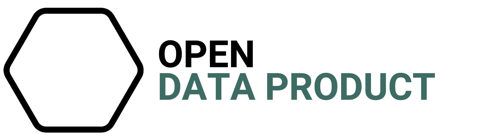

[](https://github.com/open-lifeworlds/open-lifeworlds-data-product-municipalities/issues)

<br />
<p align="center">
  <a href="https://github.com/open-data-product/open-data-product-municipalities">
    
  </a>

  <h1 align="center">Municipalities</h1>

  <p align="center">
    Data product providing TODO
  </p>
</p>

## About The Project

See

* [Data Product Canvas](docs/data-product-canvas.md)
* [Open Data Product Specification canvas](./docs/odps-canvas.md) and
* [Data Product Descriptor Specification canvas](./docs/dpds-canvas.md)

See also [main.ipynb](./main.ipynb) for a sample notebook.

### Built With

* [Python](https://www.python.org/)
* [uv](https://docs.astral.sh/uv/)
* [ruff](https://docs.astral.sh/ruff/)

## Installation

Install uv, see https://github.com/astral-sh/uv?tab=readme-ov-file#installation.

```shell
# On macOS and Linux.
curl -LsSf https://astral.sh/uv/install.sh | sh
```

## Usage

Run this command to generate and activate a virtual environment.

```shell
uv venv
source .venv/bin/activate
```

Run this command to install dependencies defined in `pyproject.toml`.

```shell
uv sync
```

Run this command to re-install the Open Data Product Python library (if necessary).

```shell
uv pip install --no-cache-dir git+https://github.com/open-data-product/open-data-product-python-lib.git
```

Run this command to start the main script.

```shell
uv run main.py
```

## Roadmap

See
the [open issues](https://github.com/open-data-product/open-data-product-municipalities/issues)
for a list of proposed features (and
known issues).

## License

Source data distributed under [Data Licence Germany – Attribution – Version 2.0](https://www.govdata.de/dl-de/by-2-0) by [Statistisches Bundesamt (Destatis), GV-ISys](https://www.destatis.de/DE/Home/_inhalt.html).

Data product distributed under the [CC-BY 4.0 License](https://creativecommons.org/licenses/by/4.0/).
See [LICENSE.md](./LICENSE.md) for more information.

## Contact

opendataproduct@gmail.com
